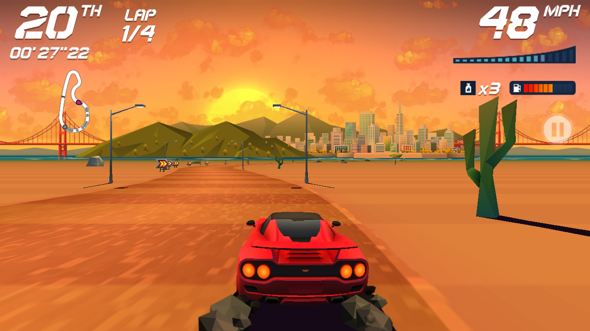
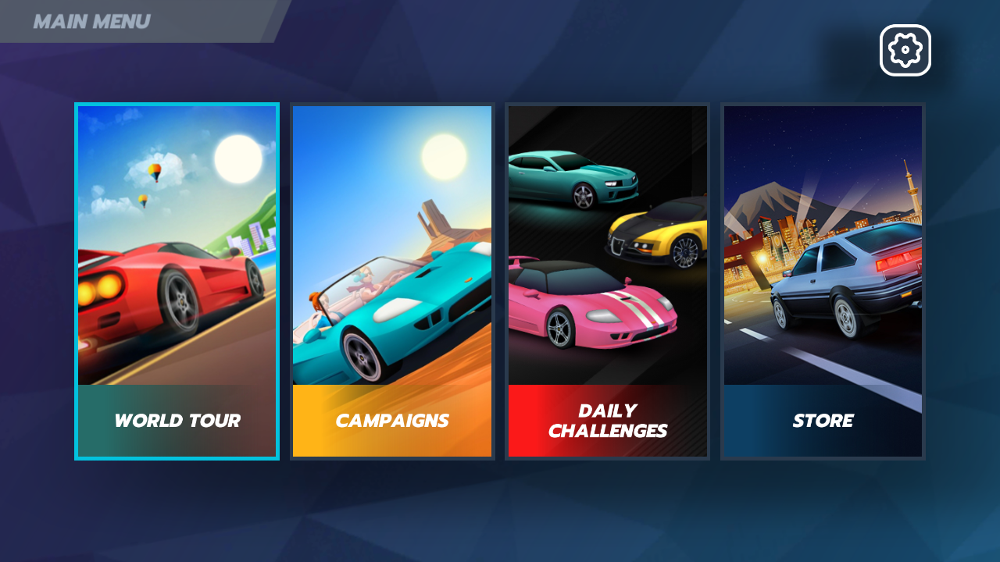

# Horizon Chase 2.6.9 — universal AArch64 Unity/IL2CPP port

[](https://github.com/NextOs-Ports/horizonchase-nextos/actions/workflows/ci.yml)
[](https://github.com/NextOs-Ports/horizonchase-nextos/releases/latest)
[](https://github.com/NextOs-Ports/horizonchase-nextos/blob/main/LICENSE)

**Language / Idioma:** [English](#english) · [Português](#português)

This project is an independent compatibility loader. It does not distribute
Horizon Chase's APK, Unity/IL2CPP libraries, art, music or any other
proprietary game data.

[Download the latest PortMaster package / Baixar o pacote PortMaster](https://github.com/NextOs-Ports/horizonchase-nextos/releases/latest)

## Support this work

These ports take real time and real money to build. If you enjoy them:

- 💗 **GitHub Sponsors**: [github.com/sponsors/NextOs-Ports](https://github.com/sponsors/NextOs-Ports)
- ☕ **Ko-fi** (PayPal/card): [ko-fi.com/nextos](https://ko-fi.com/nextos)
- 🇧🇷 **PIX**: [livepix.gg/nextos](https://livepix.gg/nextos)

## Community

Questions, bug reports, help getting the port running, and news about the next ones:

💬 **Discord:** [discord.gg/DHfY62eDNN](https://discord.gg/DHfY62eDNN)

## English

### Status

Horizon Chase's original Android ARM64 build is playable through its native
Unity 2022.3.33f1 flow. One low-glibc AArch64 loader now runs unchanged across
the validated fbdev and KMSDRM devices:

| Physical target | Display / GPU | Validated result |
|---|---|---|
| NextOS, about 1 GB | 1280×720 Mali-450, SDL `mali`/fbdev, GLES2 | title, menus, cars, complete races, music/SFX, native controller, save/reload and clean exit |
| ArkOS/R36S, about 640 MiB exposed RAM + 512 MiB test swap | 640×480 Mali-G31, KMSDRM, GLES3 | complete race, native ASTC/ETC2, music/SFX, native controller, persistent save and frontend return |
| NextOS X5, 4 GB | 1920×1080 Mali-G310, KMSDRM, GLES3.2 | first-run APK extraction, title-to-gameplay navigation, HUD/race audio, sustained 30.0 FPS, save and clean exit |
| ROCKNIX/RG-DS | 640×480 Mali-G52, Wayland/Panfrost, GLES3.1 | smooth first-run XAPK extraction, title/menu, clear ALSA music/SFX, native controller and clean hotkey exit |

The public package uses the same loader SHA on all four classes of device. It
does not force an SDL video or audio driver. Backend ownership, GLES version,
compressed-texture path, display size, audio output and memory tier are
selected from the running system.





Measured release figures are workload-specific:

- Mali-450 menu validation used about 245 MiB RSS with no swap.
- X5 gameplay at 1920×1080 used about 503 MiB PSS / 841 MiB RSS; roughly
  382 MiB of the RSS was file-backed, and swap remained zero.
- The X5 lifecycle held 30.0 FPS after scene-loading intervals.
- The low-memory R36S profile keeps compressed textures native and caps only
  oversized raw/decoded textures. The authorized 512 MiB swap is safety
  margin, not a substitute for the memory policy.

The complete Mali-450-to-R36S investigation, including failed approaches, is
in [`R36S-MIGRATION.md`](R36S-MIGRATION.md).

### Architecture

The host intercepts Android interfaces without replacing the game's startup
or gameplay sequence:

1. Map and relocate every `PT_LOAD` segment of `libunity.so`, run its complete
   `init_array`, then call `JNI_OnLoad`.
2. Reproduce the Activity, Surface, HandlerThread and Choreographer lifecycle
   expected by Unity.
3. Map `libil2cpp.so`, run its complete `init_array`, call `JNI_OnLoad`, and
   expose the APK/PAD paths through the emulated Java environment.
4. Let Unity load its own scenes, asset bundles, scripts and gameplay code.
5. Deliver real Mali EGL/GLES, FMOD PCM through SDL audio, and a normalized
   Xbox controller at Horizon's own `GamepadInputSource` boundary.
6. On exit, send focus loss and pause, atomically flush typed preferences,
   stop audio and return to the frontend.

The loader supplies only the Android/Bionic, JNI, pthread, semaphore, asset,
EGL and OpenSL compatibility surfaces required by this exact game version.
Rendering still reaches the device's real GPU driver.

### Main problems solved

| Symptom | Root cause | Final solution |
|---|---|---|
| New NDK library mapped without a text base | Four `PT_LOAD` segments; first segment is read-only | Discover the executable segment independently and restore protection per segment |
| Boot deadlock | Missing HandlerThread/Choreographer and Bionic synchronization ABI | Reproduce Android lifecycle and bridge mutex, condition and semaphore operations to glibc |
| PAD data missing | Unity expects an install-time split in `splitPublicSourceDirs` | Expose and deterministically build `UnityDataAssetPack.apk` with the original internal asset path |
| Mali-450 crash/black assets | It has no ASTC or ETC2 support | Preserve native ETC1 and software-decode only unsupported final uploads |
| Track layers missing | Backgrounds use ETC1 RGB plus a separate Alpha8 layer | Preserve the two authored layers and their sampler relationship |
| UI/cars invisible after decode | One Unity sprite variant sampled a zero external-alpha dummy | Use alpha from the decoded main atlas only for that exact variant |
| Shader link failure on Utgard | `_MainTex_ST` precision differed between stages | Normalize only that affected declaration |
| Correct RGB scanned out black | Amlogic fbdev compositor blended backbuffer alpha zero | Clear only default-backbuffer alpha to one before swap, then restore GL state |
| Audio but no KMS image | Swappy remained selected without Android frame timestamps | Disable the exact Unity Swappy state after native Surface initialization |
| Unity skipped KMS swaps | Current surface was returned with equal text but different handle identity | Preserve the exact draw/read handles from `eglMakeCurrent` |
| KMS window stayed black | Raw EGL moved Unity contexts outside SDL's KMS ownership | Automatically use SDL-owned contexts on KMSDRM/Wayland; keep raw EGL only for SDL `mali` fbdev |
| Cars vanished during a RAM experiment | Manual VBO retirement violated Unity ownership | Remove the experiment completely; buffers remain engine-owned |
| FMOD stream failed outside ART | Android stream worker expected Java AudioTrack | Retry as resident sample and feed the original PCM through SDL |
| Audio busy or routed to the wrong sink | Frontend/firmware backends differ | Retry inherited output, then negotiate PipeWire/Pulse/ALSA and real speaker outputs; never accept dummy/disk |
| Progress disappeared | SharedPreferences was initially in-memory only | Atomic typed persistence for strings, integers, floats, longs and booleans |
| Generic Android input missed gameplay | Unity's Android Input device did not receive Linux evdev | Hook the game's 17 native input points and normalize SDL to Xbox/XInput |
| Second launch fought the first | Stale or replaced processes still owned DRM/Mali/audio | Foreground lock plus executable, command-line, `comm` and working-directory checks, including `(deleted)` executables |

The long polygonal shadows in sunset races are part of the original
low-poly presentation. They are not texture corruption.

### Adaptive display, performance and memory

The release defaults reproduce the game's 30 Hz Android Choreographer cadence
with absolute-deadline pacing. No scene or lifecycle step is skipped.

- SDL backend `mali` selects the validated raw-EGL/fbdev path.
- KMSDRM and Wayland-class backends retain context bind/unbind/present inside
  SDL.
- KMS devices below 1.25 GB use a 512-pixel cap for oversized raw or
  software-decoded textures.
- fbdev and other low-memory paths default to 768.
- KMS devices with at least 1.7 GB keep raw textures at authored resolution.
- ASTC, ETC1 and ETC2 remain compressed whenever the GPU supports them.
- `MALLOC_ARENA_MAX=2` limits per-worker glibc heap retention.
- Temporary full ELF images are released after relocation and hook setup.
- Diagnostic draw watchdogs and framebuffer capture are compiled out of
  public binaries.

### Audio

Unity/FMOD keeps control of music and sound effects. The compatibility layer
implements Android AudioTrack/OpenSL behavior over queued SDL PCM at 24 kHz,
stereo. Output selection is adaptive:

1. use the firmware's inherited working backend, except an inherited
   PulseAudio-only selection whose server path is known to block before an
   error can be returned;
2. retry while the frontend releases its device;
3. negotiate real ALSA/PipeWire/Pulse backends if needed;
4. prefer speaker-capable outputs and leave HDMI as a fallback;
5. reject silent `dummy` and `disk` drivers.

The public launcher never pins `SDL_AUDIODRIVER`.

### Controls

SDL controllers are normalized to Xbox/XInput. Menu and vehicle behavior
after that boundary is the game's own code.

| Control | Action |
|---|---|
| Left stick / D-pad | Navigate; steer |
| A / RT | Confirm; accelerate |
| B / X / LB | Cancel or nitro, according to the current game context |
| Y | Camera |
| LT | Analog action |
| RB | Native bumper action / accelerate where supported |
| Start | Pause |
| Select + Start | Focus-loss, pause, save flush and exit |

### Install with your own game data

The release is BYO-data. Obtain a legal ARM64 copy of Horizon Chase Android
2.6.9.

1. Extract `horizonchase.zip` into the firmware's ports directory.
2. Put the legal APK, every split APK, or one complete APKS/APKM/XAPK bundle
   in `horizonchase/gamedata/`. The filename does not matter.
3. Launch **Horizon Chase**.

NXExtract 1.1.2 identifies content instead of trusting filenames. The pinned
recipe verifies package identity, ABI, every required library, exact Unity
and Android asset trees, sizes, hashes and ELF machine. It stages the payload,
builds the deterministic Unity asset-pack, validates everything, and commits
atomically. A failed or wrong version cannot replace a working installation.
The user's source archive is never deleted.

On subsequent starts, a small marker validation bypasses source scanning.
Known private pre-release installs are migrated once: the obsolete
`swappy.disable=1` line is removed only when its complete file hash matches,
the old file is backed up under `userdata/migration-backups`, and the asset
pack is rebuilt deterministically before NXExtract adopts the data.

The resulting runtime layout is:

```text
horizonchase/
├── horizonchase
├── run.sh
├── run-extractor.sh
├── nxextract.py
├── nxextract-ui
├── extractor.json
├── libastcUtil.so
├── gamedata/                         # user-owned source archive
├── libunity.so                       # extracted on first run
├── libil2cpp.so
├── libmain.so
├── UnityDataAssetPack.apk
├── bin/Data/
├── Android/
└── userdata/                         # persistent preferences/save
```

### Bring your Android profile over (offline)

Horizon Chase is free-to-play: the APK ships every track, but the campaign
beyond the demo is released by an entitlement stored in the player's profile,
not by the files on disk. That entitlement is granted by the Google Play
purchase flow, which this offline port has no bridge to — a fresh install
therefore starts on the demo, exactly like a phone that never bought it.

If you own the full game on Android, carry your own profile across. Horizon
Chase keeps everything — progress and the entitlements attached to it — in a
single Unity PlayerPrefs entry, `user_profile`.

Pull it from the phone and drop it into `gamedata/`, next to the APK:

```sh
# on the Android device (SharedPreferences live in internal storage)
adb pull /data/data/com.aquiris.horizonchase/shared_prefs/\
com.aquiris.horizonchase.v2.playerprefs.xml

# then copy that file into the port's gamedata/ folder
```

The next launch picks it up on its own. The launcher checks that the file
really is a Horizon Chase profile, reports what it carries (revision, cups,
races, tokens, entitlements), merges it into `userdata/shared_prefs.bin` and
moves the source to `userdata/save-imports/`. Progress and purchases then work
fully offline; the port never contacts a store.

The source is consumed once on purpose: re-importing on every launch would
overwrite progress made on the handheld with whatever the phone had.

Only the profile itself is imported. The rest of a phone's SharedPreferences
describes that phone — resolution, quality, audio routing — and would override
the settings tuned for the handheld.

The same tool runs by hand from a PC, against an unpacked port directory:

```sh
python3 tools/import_android_save.py com.aquiris.horizonchase.v2.playerprefs.xml \
        -g /path/to/horizonchase
```

`-n` inspects a profile without writing; `--all` also takes the phone's
settings. The previous save is always kept as `shared_prefs.bin.bak`.

Nothing is ever synthesized: the port releases only what the player's own
profile already proves. A profile without the purchase imports its progress and
stays on the demo, and is reported as such.

The DLC campaigns work the same way. Their content ships inside the APK, so
once a profile carries them they run offline like everything else. Ownership is
read from the campaign's own progress, never from a flag: a profile that owns
nothing already carries every DLC container, zeroed, and even carries
`IsEasyUnlocked`. Only a race the player actually ran proves the campaign was
theirs. The importer reports which campaigns it found.

Pulling the XML needs root or a backup tool that can read app-private data.
Without it, only the Android device itself holds the entitlement.

### Build

The normal internal NextOS build follows the current NextOS toolchain/sysroot
and reports that sysroot's glibc:

```sh
./build.sh
```

The public multi-firmware binary is the explicitly authorized low-glibc
variant:

```sh
./build_universal.sh
# -> horizonchase-universal
```

It compiles AArch64 in Debian Buster, uses the current NextOS sysroot only for
SDL/EGL/GLES headers, links SDL by runtime SONAME, rejects symbols above
`GLIBC_2.30`, and audits the Bionic stack-guard TLS layout. The validated
binary currently requires at most `GLIBC_2.27`.

Build the deterministic public PortMaster ZIP with:

```sh
package/build-portmaster-package.sh
# -> package/dist/horizonchase.zip
```

The packager uses a sorted allowlist, verifies AArch64/glibc/TLS, syntax-checks
shell and Python, validates metadata and the NXExtract recipe, rejects game
libraries/APKs/Unity data, scans for local paths or test addresses, writes a
SHA-256 manifest and verifies the finished ZIP.

### Supported overrides

| Variable | Effect |
|---|---|
| `HC_GAMEDIR=/path` | Absolute runtime root; launchers set it automatically |
| `HC_FRAME_LIMIT=N` | Lifecycle cadence; default is 30 |
| `HC_PURE_SDL_CONTEXTS=0\|1` | Explicitly override automatic context ownership |
| `HC_RAW_EGL_CONTEXTS=1` | Engineering escape hatch for raw EGL |
| `CUP_TEXHALF=N` | Override the automatic raw/decoded texture cap |
| `HC_AUDIO_DRIVER=name` | Request one SDL audio backend before the fallback ladder |
| `HC_AUDIO_ENUM=1` | Enumerate named SDL outputs during recovery |
| `HC_NO_PREFER_SPEAKER=1` | Disable speaker-first output ordering |
| `HC_AUDIO_KEEP_INHERITED_PULSE=1` | Engineering test: keep an inherited PulseAudio selection instead of the ALSA escape |
| `HC_NO_AUDIO=1` | Diagnostic mute |
| `HC_FORCE_SOFTWARE_TEXTURES=1` | Exercise software ASTC/ETC2 fallback |
| `HC_NO_TEXTURE_DECODE=1` | Native-upload diagnostic only |
| `HC_GLES_MAJOR=2\|3` | Request a GLES version for engineering tests |
| `HC_NO_OPAQUE_BACKBUFFER=1` | Disable the fbdev A-only scanout fix |
| `HC_NO_SHADER_PRECISION_FIX=1` | Disable the targeted Mali shader correction |
| `HC_VERBOSE=1` | Enable high-volume bring-up logging |

### Source map

- `src/main.c` — Android lifecycle, Unity/IL2CPP loading, Swappy, GLES,
  textures, FMOD worker, pacing and clean exit.
- `src/jni_shim.c` — JavaVM/JNIEnv, Activity/Surface, assets/PAD, AudioTrack
  and persistent SharedPreferences.
- `src/horizon_input.c` — the 17 Horizon `GamepadInputSource` hooks and
  SDL/Xbox normalization.
- `src/egl_shim.c` — backend auto-detection, exact EGL handles and SDL-owned
  KMS contexts.
- `src/astc_decode.c`, `src/etc2_decode.c` — GLES2 texture fallback.
- `src/opensles_shim.c` — OpenSL compatibility over SDL audio.
- `src/pthread_fake.c`, `src/sem_shim.c` — Bionic synchronization bridge.
- `src/so_util.c` — AArch64 ELF mapping, relocation and temporary-image
  release.
- `build.sh` — current NextOS sysroot build.
- `build_universal.sh`, `build_r36s.sh` — public low-glibc AArch64 build and
  compatibility audits.
- `package/universal/extractor.json` — pinned Horizon Chase 2.6.9 extraction
  recipe.
- `tools/build_unity_asset_pack.py` — deterministic PAD ZIP builder.
- `package/build-portmaster-package.sh` — audited BYO-data release builder.
- `third_party/NXExtract` — standalone-release copy of the pinned MIT
  first-run installer; monorepo builds use the canonical shared copy.
- `R36S-MIGRATION.md` — detailed fbdev-to-KMS engineering record.

### Licenses

The loader source is GPL-3.0. Reused components retain their original notices
in `NOTICE.md` and `licenses/`. `libastcUtil.so` is a separately linked
decompression-only build of Arm astcenc under Apache-2.0. NXExtract is MIT.
Horizon Chase and all supplied game data remain separate proprietary works of
their rightsholders. This project is not affiliated with or endorsed by
Aquiris, Epic Games or Unity Technologies.

## Português

### Apoie este trabalho

Fazer esses ports custa tempo e dinheiro de verdade. Se curte o resultado:

- 💗 **GitHub Sponsors**: [github.com/sponsors/NextOs-Ports](https://github.com/sponsors/NextOs-Ports)
- ☕ **Ko-fi** (PayPal/cartão): [ko-fi.com/nextos](https://ko-fi.com/nextos)
- 🇧🇷 **PIX**: [livepix.gg/nextos](https://livepix.gg/nextos)

### Comunidade

Dúvidas, relatos de bug, ajuda pra colocar o port pra rodar e novidades dos próximos:

💬 **Discord:** [discord.gg/DHfY62eDNN](https://discord.gg/DHfY62eDNN)

### Estado

O build Android ARM64 original do Horizon Chase está jogável pelo fluxo nativo
do Unity 2022.3.33f1. Um único loader AArch64 de glibc baixa roda sem alteração
nos aparelhos fbdev e KMSDRM validados:

| Alvo físico | Vídeo / GPU | Resultado validado |
|---|---|---|
| NextOS, cerca de 1 GB | 1280×720 Mali-450, SDL `mali`/fbdev, GLES2 | título, menus, carros, corridas completas, música/efeitos, controle nativo, save/reload e saída limpa |
| ArkOS/R36S, cerca de 640 MiB expostos + 512 MiB de swap de teste | 640×480 Mali-G31, KMSDRM, GLES3 | corrida completa, ASTC/ETC2 nativos, música/efeitos, controle nativo, save persistente e retorno ao frontend |
| NextOS X5, 4 GB | 1920×1080 Mali-G310, KMSDRM, GLES3.2 | extração real do APK, navegação do título ao gameplay, HUD/som da corrida, 30,0 FPS sustentados, save e saída limpa |
| ROCKNIX/RG-DS | 640×480 Mali-G52, Wayland/Panfrost, GLES3.1 | extração inicial suave do XAPK, título/menu, música/efeitos claros via ALSA, controle nativo e saída limpa pelo atalho |

O pacote público usa o mesmo SHA do loader nas quatro classes. Ele não força
driver SDL de vídeo nem de áudio. Ownership de contexto, versão GLES, caminho
das texturas comprimidas, resolução, saída de som e perfil de memória são
decididos pelo sistema em execução.

Medições do release dependem da cena:

- o menu no Mali-450 usou cerca de 245 MiB RSS, sem swap;
- a corrida do X5 em 1920×1080 usou cerca de 503 MiB PSS / 841 MiB RSS, dos
  quais aproximadamente 382 MiB eram mapeamentos de arquivo, com swap zero;
- depois dos intervalos de carregamento, o lifecycle do X5 manteve 30,0 FPS;
- no R36S, formatos comprimidos ficam nativos e só texturas cruas/decodificadas
  grandes recebem teto. Os 512 MiB de swap autorizados são margem de segurança.

Toda a investigação Mali-450 → R36S está em
[`R36S-MIGRATION.md`](R36S-MIGRATION.md).

### Arquitetura

O host intercepta as interfaces Android sem substituir a ordem do jogo:

1. mapeia todos os `PT_LOAD` da `libunity.so`, reloca, executa o `init_array`
   completo e chama `JNI_OnLoad`;
2. reproduz Activity, Surface, HandlerThread e Choreographer;
3. mapeia `libil2cpp.so`, executa seu `init_array`, chama `JNI_OnLoad` e expõe
   APK/PAD pelo ambiente Java emulado;
4. deixa o Unity carregar cenas, bundles, scripts e gameplay originais;
5. entrega EGL/GLES real do Mali, PCM do FMOD pelo SDL e controle Xbox na
   fronteira `GamepadInputSource` do Horizon;
6. ao sair, envia perda de foco e pause, grava preferências tipadas
   atomicamente, encerra áudio e devolve o frontend.

### Principais problemas resolvidos

| Sintoma | Causa | Solução final |
|---|---|---|
| biblioteca NDK sem base de texto | quatro `PT_LOAD`; primeiro é read-only | descobrir o segmento executável separadamente e restaurar proteção por segmento |
| boot travado | lifecycle e ABI de sincronização Bionic ausentes | reproduzir lifecycle Android e ligar mutex/cond/semaphore ao glibc |
| PAD ausente | Unity espera split em `splitPublicSourceDirs` | expor e gerar `UnityDataAssetPack.apk` determinístico |
| crash/texturas pretas no Mali-450 | sem ASTC/ETC2 | manter ETC1 nativo e decodificar só uploads não suportados |
| fundo de pista ausente | ETC1 RGB + Alpha8 em duas camadas | preservar as duas camadas e os samplers |
| UI/carro invisível | variante usava dummy de alpha externo zerado | usar o alpha do atlas principal somente nessa variante |
| shader não linkava | precisão diferente em `_MainTex_ST` | normalizar só a declaração afetada |
| RGB correto aparecia preto | compositor fbdev usava alpha zero | clear apenas do alpha do backbuffer antes do swap |
| áudio sem imagem no KMS | Swappy sem timestamps Android | desligar o estado exato após inicializar Surface |
| Unity pulava swaps | identidade errada do `EGLSurface` | devolver os handles draw/read exatos |
| window KMS preta | EGL cru fora do ownership SDL | contextos SDL em KMSDRM/Wayland; EGL cru só no backend `mali` |
| carros sumiam na otimização | descarte manual de VBO violava ownership | remover completamente o experimento |
| stream FMOD falhava | worker esperava ART/AudioTrack | refazer como sample residente e enviar PCM pelo SDL |
| áudio ocupado/saída errada | firmwares têm backends diferentes | retentar e negociar PipeWire/Pulse/ALSA/alto-falante; rejeitar dummy/disk |
| progresso sumia | SharedPreferences só em memória | persistência tipada e atômica |
| evdev não chegava ao gameplay | Input Android do Unity não era populado | hook nos 17 pontos nativos e normalização SDL→Xbox |
| duas instâncias brigavam | processo velho ainda possuía DRM/Mali/áudio | lock e checagem de exe/cmdline/`comm`/cwd, inclusive `(deleted)` |

As sombras poligonais longas das pistas de pôr do sol pertencem à arte
low-poly original; não são corrupção de textura.

### Vídeo, performance e memória adaptativos

O padrão reproduz a cadência Android de 30 Hz com deadlines absolutos, sem
pular cenas nem lifecycle:

- SDL `mali` escolhe EGL/fbdev validado;
- KMSDRM/Wayland mantém bind, unbind e present sob ownership do SDL;
- KMS abaixo de 1,25 GB usa teto 512 para texturas cruas/decodificadas;
- fbdev e outros perfis de pouca RAM usam 768;
- KMS com pelo menos 1,7 GB preserva resolução crua original;
- ASTC, ETC1 e ETC2 ficam comprimidos quando a GPU aceita;
- `MALLOC_ARENA_MAX=2` limita retenção de heap dos workers;
- imagens ELF temporárias são liberadas depois da relocação/hooks;
- watchdog/captura pesados não entram no binário público.

### Áudio

Unity/FMOD continua comandando música e efeitos. O bridge implementa
AudioTrack/OpenSL sobre PCM SDL em 24 kHz estéreo. Ele usa o backend herdado,
mas evita uma seleção PulseAudio herdada que bloqueie antes de devolver erro;
nesse caso, o ALSA disponível é aberto diretamente. Depois ele espera o
frontend liberar o device e, se necessário, negocia ALSA/PipeWire/Pulse e
saídas reais de alto-falante. Drivers `dummy` e `disk` nunca são aceitos. O
launcher não fixa `SDL_AUDIODRIVER`.

### Controles

| Controle | Ação |
|---|---|
| Analógico esquerdo / D-pad | Navegar; esterçar |
| A / RT | Confirmar; acelerar |
| B / X / LB | Voltar ou nitro, conforme o contexto |
| Y | Câmera |
| LT | Ação analógica |
| RB | Ação nativa / acelerar onde suportado |
| Start | Pausa |
| Select + Start | Perda de foco, pause, flush do save e saída |

### Instalação com seus próprios dados

É um release BYO-data. Use uma cópia legal ARM64 do Horizon Chase Android
2.6.9:

1. extraia `horizonchase.zip` no diretório de ports do firmware;
2. coloque o APK, todos os splits, ou um APKS/APKM/XAPK completo em
   `horizonchase/gamedata/`; o nome não importa;
3. abra **Horizon Chase**.

O NXExtract 1.1.2 identifica conteúdo, pacote, ABI, bibliotecas, árvores
Unity/Android, tamanhos, hashes e máquina ELF. Ele extrai numa área de stage,
gera o asset-pack determinístico, valida tudo e publica atomicamente. Uma
versão errada não substitui instalação boa, e o arquivo do usuário nunca é
apagado. Nas próximas aberturas, o marcador validado evita reler o APK.

Instalações privadas antigas são migradas uma vez: a linha obsoleta
`swappy.disable=1` só é retirada quando o hash completo bate; o original vai
para `userdata/migration-backups`; o asset-pack é refeito e então os dados são
adotados pelo NXExtract.

### Trazer seu perfil do Android (offline)

O Horizon Chase é free-to-play: o APK traz todas as pistas, mas a campanha
além da demo é liberada por um direito guardado no perfil do jogador, não
pelos arquivos em disco. Quem concede esse direito é o fluxo de compra da
Google Play, com o qual este port offline não conversa — por isso uma
instalação nova começa na demo, igual a um celular que nunca comprou.

Se você tem o jogo completo no Android, traga o seu próprio perfil. O Horizon
Chase guarda tudo — o progresso e os direitos ligados a ele — numa única
entrada de PlayerPrefs, `user_profile`.

Puxe o arquivo do celular e largue em `gamedata/`, junto do APK:

```sh
# no aparelho Android (SharedPreferences ficam na memória interna)
adb pull /data/data/com.aquiris.horizonchase/shared_prefs/\
com.aquiris.horizonchase.v2.playerprefs.xml

# depois copie esse arquivo para a pasta gamedata/ do port
```

A próxima abertura reconhece sozinha. O launcher confere que o arquivo é mesmo
um perfil do Horizon Chase, mostra o que ele carrega (revisão, copas, corridas,
tokens, produtos), funde com o `userdata/shared_prefs.bin` e move a origem para
`userdata/save-imports/`. Depois disso o progresso e as compras valem offline;
o port nunca fala com loja nenhuma.

A origem é consumida uma vez de propósito: reimportar a cada abertura
sobrescreveria com o perfil velho do celular o progresso feito no aparelho.

Só o perfil é importado. O resto das SharedPreferences descreve aquele celular
— resolução, qualidade, rota de áudio — e passaria por cima dos ajustes
calibrados para o portátil.

A mesma ferramenta roda na mão, do PC, sobre uma pasta do port descompactada:

```sh
python3 tools/import_android_save.py com.aquiris.horizonchase.v2.playerprefs.xml \
        -g /caminho/do/horizonchase
```

Com `-n` ele só inspeciona, sem gravar; com `--all` leva também os ajustes do
celular. O save anterior fica sempre guardado em `shared_prefs.bin.bak`.

Nada é inventado: o port libera apenas o que o perfil do próprio jogador já
comprova. Um perfil sem a compra importa o progresso, continua na demo e é
avisado disso.

Com os DLCs é igual. O conteúdo deles vem dentro do APK, então uma vez que o
perfil os carrega eles rodam offline como o resto. A posse é lida pelo
progresso da própria campanha, nunca por um sinalizador: um perfil que não
comprou nada já traz todos os containers de DLC zerados, e ainda traz
`IsEasyUnlocked`. Só uma corrida que o jogador realmente rodou prova que a
campanha era dele. O importador informa quais campanhas encontrou.

Puxar o XML exige root ou um app de backup que leia dados privados. Sem isso,
o direito continua só no aparelho Android.

### Compilar e empacotar

Build interno com o toolchain/sysroot atual do NextOS:

```sh
./build.sh
```

Build público AArch64 multi-firmware explicitamente autorizado:

```sh
./build_universal.sh
# -> horizonchase-universal
```

Ele compila no Debian Buster, usa o sysroot NextOS atual somente para headers
SDL/EGL/GLES, liga SDL por SONAME, rejeita símbolos acima de `GLIBC_2.30` e
audita o TLS do stack guard Bionic. O binário validado exige no máximo
`GLIBC_2.27`.

Pacote público determinístico:

```sh
package/build-portmaster-package.sh
# -> package/dist/horizonchase.zip
```

O empacotador usa allowlist ordenada, audita AArch64/glibc/TLS, valida scripts,
metadados e receita NXExtract, rejeita APK/bibliotecas/dados Unity e caminhos
privados, cria manifesto SHA-256 e testa o ZIP final.

### Variáveis suportadas

| Variável | Efeito |
|---|---|
| `HC_GAMEDIR=/caminho` | raiz absoluta do runtime |
| `HC_FRAME_LIMIT=N` | cadência; padrão 30 |
| `HC_PURE_SDL_CONTEXTS=0\|1` | sobrescreve o ownership automático |
| `HC_RAW_EGL_CONTEXTS=1` | escape de engenharia para EGL cru |
| `CUP_TEXHALF=N` | sobrescreve o teto automático |
| `HC_AUDIO_DRIVER=nome` | pede um backend antes da cascata |
| `HC_AUDIO_ENUM=1` | enumera saídas SDL na recuperação |
| `HC_NO_PREFER_SPEAKER=1` | desliga preferência por alto-falante |
| `HC_AUDIO_KEEP_INHERITED_PULSE=1` | teste de engenharia: mantém PulseAudio herdado em vez do escape ALSA |
| `HC_NO_AUDIO=1` | mudo de diagnóstico |
| `HC_FORCE_SOFTWARE_TEXTURES=1` | testa decoder ASTC/ETC2 |
| `HC_GLES_MAJOR=2\|3` | pede uma versão GLES para engenharia |
| `HC_NO_OPAQUE_BACKBUFFER=1` | desliga o fix alpha-only do fbdev |
| `HC_NO_SHADER_PRECISION_FIX=1` | desliga a correção Mali específica |
| `HC_VERBOSE=1` | log volumoso de bring-up |

### Mapa do código

- `src/main.c`: lifecycle, Unity/IL2CPP, Swappy, GLES, texturas, FMOD, pacing
  e saída limpa;
- `src/jni_shim.c`: Java/JNI, Activity/Surface, assets/PAD, AudioTrack e save;
- `src/horizon_input.c`: 17 hooks nativos e controle SDL/Xbox;
- `src/egl_shim.c`: autodetecção, handles EGL e contextos SDL/KMS;
- `src/astc_decode.c`, `src/etc2_decode.c`: fallback de textura GLES2;
- `src/opensles_shim.c`: OpenSL sobre áudio SDL;
- `src/pthread_fake.c`, `src/sem_shim.c`: sincronização Bionic→glibc;
- `src/so_util.c`: ELF AArch64, relocação e liberação de imagens temporárias;
- `build.sh`: build do sysroot NextOS atual;
- `build_universal.sh`, `build_r36s.sh`: build público e auditorias;
- `package/universal/extractor.json`: receita fixada da versão 2.6.9;
- `tools/build_unity_asset_pack.py`: gerador PAD determinístico;
- `package/build-portmaster-package.sh`: builder BYO-data auditado;
- `third_party/NXExtract`: cópia do instalador MIT fixada no repositório
  standalone; o monorepo usa a cópia compartilhada canônica;
- `R36S-MIGRATION.md`: documentação técnica Mali-450→R36S.

### Licenças

O loader é GPL-3.0. Componentes reutilizados mantêm seus avisos em
`NOTICE.md` e `licenses/`. `libastcUtil.so` usa astcenc em modo apenas
decodificação sob Apache-2.0. NXExtract é MIT. Horizon Chase e os dados
fornecidos pelo usuário continuam obras proprietárias separadas. Este projeto
não é afiliado nem endossado pela Aquiris, Epic Games ou Unity Technologies.
