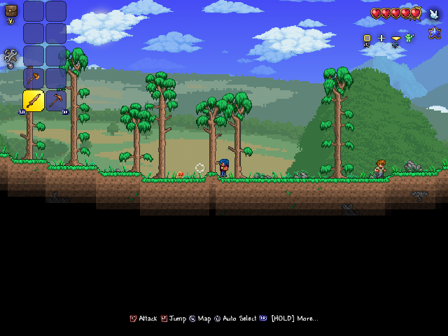
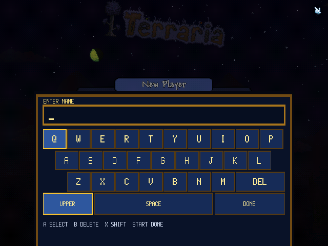
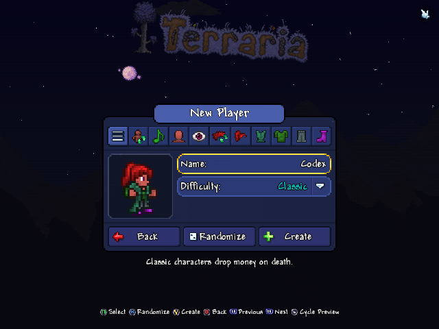
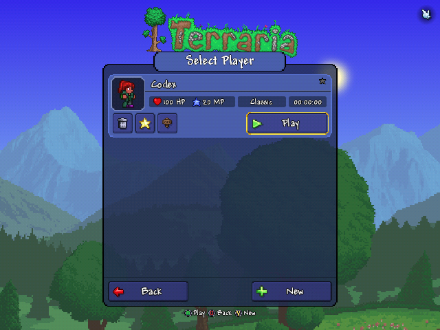
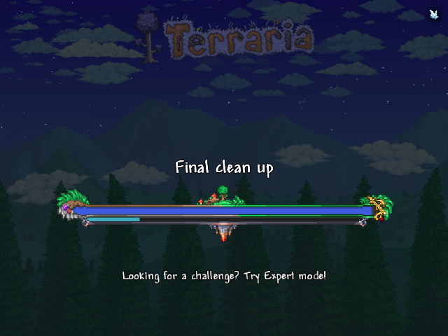
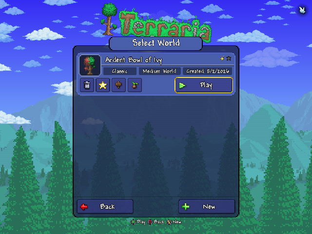

# Terraria — loader universal da versão Android para NextOS / R36S

[Português (Brasil)](README.md) · [English](README.en.md)



Este projeto executa **Terraria Android 1.4.5.6.4**, Unity 2021.3.56f2
IL2CPP, em portáteis Linux AArch64 por meio de um loader de compatibilidade
nativo. É o loader da versão Android: **não é o port FNA**, não é streaming e
não inclui o jogo.

O pacote público é BYO-data: cada pessoa fornece seu próprio APK legal. Na
primeira execução, o NXExtract 1.2.0 identifica a versão exata, valida ABI,
tamanhos e hashes, extrai somente os arquivos necessários e aplica a
configuração GLES2 de forma transacional.

## Download

- [Release v1.0.2](https://github.com/NextOs-Ports/terraria-nextos/releases/tag/v1.0.2)
- [Baixar `terraria.zip`](https://github.com/NextOs-Ports/terraria-nextos/releases/download/v1.0.2/terraria.zip)
- SHA-256: `ff21f803f0fbee4ee30bc17ac1a93746abfab1027e04ff6b00d43c2738d6294e`

## Apoie este trabalho

Fazer esses ports custa tempo e dinheiro de verdade. Se curte o resultado:

- 💗 **GitHub Sponsors**: [github.com/sponsors/NextOs-Ports](https://github.com/sponsors/NextOs-Ports)
- ☕ **Ko-fi** (PayPal/cartão): [ko-fi.com/nextos](https://ko-fi.com/nextos)
- 🇧🇷 **PIX**: [livepix.gg/nextos](https://livepix.gg/nextos)

## Comunidade

Dúvidas, relatos de bug, ajuda pra colocar o port pra rodar e novidades dos próximos:

💬 **Discord:** [discord.gg/DHfY62eDNN](https://discord.gg/DHfY62eDNN)

## Galeria — capturas reais no aparelho

| Teclado temático controlado pelo gamepad | Nome confirmado pelo fluxo original |
|---|---|
|  |  |

| Jogador criado e salvo | Geração de mundo |
|---|---|
|  |  |

| Mundo salvo e selecionável | Gameplay |
|---|---|
|  |  |

Todas as imagens acima são capturas 640x480 da validação física. Nenhuma é
mockup.

## Estado da compatibilidade

| Item | Estado |
|---|---|
| Arquitetura | Linux AArch64 / ARM64 |
| Jogo suportado | Android `1.4.5.6.4`, pacote `com.and.games505.TerrariaPaid` |
| Motor | Unity `2021.3.56f2`, IL2CPP |
| Renderização | GLES2; SDL/KMSDRM ou EGL do fornecedor conforme o backend realmente inicializado |
| Loader público | um único ELF AArch64, requisito máximo `GLIBC_2.27` |
| Interface do NXExtract | requisito máximo `GLIBC_2.17` |
| Entrada | controle Xbox/InControl nativo + teclado de nomes controlado pelo gamepad |
| Dados | APK e conteúdo do jogo fornecidos pelo proprietário; nunca incluídos |

Validação física concluída em um R36S-class com ArkOS, Mali-G31/KMSDRM e tela
640x480: boot, áudio, controle, teclado, nome do jogador, criação original,
save persistente, geração de mundo, gameplay e saída para o frontend.

A família NextOS Mali-450/fbdev mantém o caminho EGL do fornecedor já usado
pelo loader, e todos os ELFs Linux empacotados passam pelo gate de baixa
glibc. Outros firmwares e combinações de vídeo usam a mesma seleção por
capacidade, mas ainda precisam de teste físico; o projeto não promete
compatibilidade apenas porque compilou.

## Instalação rápida

1. Extraia `terraria.zip` na pasta de ports. O resultado deve deixar
   `Terraria.sh` ao lado da pasta `terraria/`.
2. Coloque seu APK Android legal do Terraria **1.4.5.6.4** em
   `terraria/gamedata/`. O nome do arquivo não importa.
3. Abra `Terraria` no frontend. O NXExtract valida e prepara os dados na
   primeira execução.
4. Para sair, use `Quit Game` dentro do Terraria ou pressione
   `SELECT+START` juntos para sair imediatamente.

O firmware precisa fornecer Python 3, SDL2, EGL e GLES2. Instruções de
instalação, atualização, espaço livre e diagnóstico estão em
[INSTALLATION.md](INSTALLATION.md).

Estrutura esperada depois de extrair o ZIP:

```text
ports/
├── Terraria.sh
└── terraria/
    ├── terraria
    ├── run.sh
    ├── extractor.json
    ├── nxextract.py
    └── gamedata/
        └── seu-apk-legal-1.4.5.6.4.apk
```

## Controles

Terraria recebe um controle no padrão Xbox pelo fluxo InControl nativo. Menu,
inventário, gameplay, ícones e remapeamento continuam pertencendo ao jogo.

No teclado de nomes:

| Ação | Botão |
|---|---|
| Navegar | D-pad |
| Ativar tecla | `A` ou `R3` |
| Apagar | `B` |
| Alternar maiúsculas/minúsculas | `X` |
| Confirmar em `DONE` | `START` |
| Cancelar | `SELECT` |
| Sair imediatamente | `SELECT+START` juntos |

`SPACE`, `SHIFT`, `DEL` e `DONE` também podem ser escolhidos diretamente. O
atalho de saída funciona inclusive enquanto o teclado está aberto. O botão
`Quit Game` do próprio Terraria também encerra o loader e retorna ao frontend.

## Como o loader evita dependência de um único aparelho

- Não há caminho absoluto fixo para `/storage/roms/terraria`.
- Não há decisão por nome de dispositivo nem suposição de `/dev/dri/card0`.
- O launcher não força `SDL_VIDEODRIVER` nem `SDL_AUDIODRIVER`.
- O backend que o SDL realmente inicializa decide quem controla o contexto:
  `mali`/fbdev usa EGL do fornecedor; KMSDRM, Wayland e outros backends SDL
  válidos usam contexto e apresentação pertencentes ao SDL.
- A resolução vem do override do launcher, depois do modo desktop do SDL, com
  fallback seguro de 640x480.
- SDL2 é usado pela ABI estável do firmware; SDL3 não é exigido nem incluído.
- Apresentação, controles, correções e ciclo de frames compartilham o mesmo
  caminho antes do swap, em vez de existirem correções exclusivas por device.
- O processo permanece em primeiro plano e o pacote não usa `setsid`, `nohup`
  nem manipulação do serviço do frontend.

## Fluxo nativo preservado

O loader respeita a sequência Android/Unity do jogo: inicialização JNI,
recriação gráfica, resume, foco, loop de renderização, perda de foco e pause.
Ele intercepta compatibilidade; não chama etapas do jogo fora de ordem.

O teclado substitui somente o teclado virtual Android ausente. Terraria ainda
executa `EnterName`, abre o editor, recebe o texto no próximo `Draw` da thread
gerenciada, chama `CloseNameEdit` e depois segue pelo botão Create original.
Isso vale para nomes de jogador e de mundo, preservando validação e saves.

O `Quit Game` preserva o fluxo original de `SaveSettings` e desligamento social,
mas conecta o `Game.Exit` vazio da versão Android ao teardown do loader. O
retorno `false` de `nativeRender` também é respeitado. Ao pressionar
`SELECT+START`, o combo é consumido antes de chegar ao menu de pausa. Todos os
caminhos convergem na perda de foco, em `nativePause` e no watchdog de três
segundos que garante o retorno caso um driver trave no último frame.

## Dados fornecidos pelo proprietário

Fonte aceita:

- pacote Android: `com.and.games505.TerrariaPaid`;
- versão do jogo: `1.4.5.6.4`;
- Unity: `2021.3.56f2`, IL2CPP;
- ABI: `arm64-v8a`.

A receita rejeita outra versão mesmo que o arquivo seja renomeado. O APK,
`libunity.so`, `libil2cpp.so`, `libc++_shared.so`, dados Unity, saves e logs de
execução não entram no Git nem no ZIP público.

## NXExtract 1.2.0

O código completo e fixado do NXExtract está em `third_party/NXExtract/`,
originado do framework multi-device no commit
`400f87fb2aa4807d817403e23eb6965e3dd308e9`. A execução ocorre em ambiente de
bibliotecas isolado para impedir que bibliotecas Android extraídas contaminem
o Python ou a interface de instalação.

Hashes fixados do runtime:

- `nxextract.py`: `55664066d2ff0e5b7b83b6285d6606cca74923e80183d2f2e176e6353b93abd5`
- `nxextract-runtime-env.sh`: `332919a9960d4317563b647f9932d1a4367da147a425fe2f78eafd706f01563f`
- `run-extractor.sh`: `3c61f638a25f0ca9c5c5a94d33660886aaff17a18347c9e954afd4b0e9b3efba`
- `nxextract-ui`: `046afb583f5a211c946495e639409f81d9cfec706788eeccb7924b0e8e5a50b6`

## Build e pacote

O host de build precisa de Docker, Bash, Python 3, `readelf`, ferramentas ZIP
e o sysroot NextOS Amlogic-old atual para os headers SDL/EGL/GLES.

```sh
./build_universal.sh
./package/build-package.sh
```

O primeiro script compila em Debian Buster e verifica o teto de glibc e o
layout do guard TLS bionic. O segundo audita todos os ELFs do estágio, scripts,
metadados e receita; rejeita conteúdo proprietário ou diagnóstico e produz um
ZIP determinístico com SHA-256.

Depois de instalar os dados próprios com o NXExtract, o source tree pode ser
executado com:

```sh
./Terraria.sh
```

## Mapa do código

- `src/`: loader ELF, compatibilidade bionic/JNI/pthread/OpenSL/EGL e hooks do
  Terraria.
- `run.sh`: runtime em primeiro plano e neutro de firmware.
- `package/r36s/Terraria.sh`: entrada PortMaster e gate BYO-data.
- `package/universal/extractor.json`: receita de extração por conteúdo.
- `tools/prepare_terraria_data.py`: validação e patch controlado de
  `boot.config`.
- `third_party/NXExtract/`: fonte/runtime completo do NXExtract 1.2.0.
- `package/build-package.sh`: empacotamento determinístico e auditoria.

## Referências funcionais

- [Horizon Chase NextOS](https://github.com/NextOs-Ports/horizonchase-nextos):
  estratégia já validada de propriedade SDL/EGL multi-firmware e sinais
  bionic.
- [Prizefighters 2 NextOS](https://github.com/NextOs-Ports/prizefighters2-nextos):
  bridge pthread e desenho de teclado pelo controle já validados. O Terraria
  usa paleta própria e integração específica com seu editor de nomes.

## Licenças e independência

O código do loader é distribuído sob GNU GPL v3. Componentes de compatibilidade
mantêm seus avisos em [NOTICE.md](NOTICE.md) e em `licenses/`. NXExtract usa a
licença MIT.

Terraria e todo o conteúdo do jogo são obras proprietárias de seus respectivos
detentores. Este projeto independente de interoperabilidade não é afiliado nem
endossado pela Re-Logic, 505 Games ou Unity Technologies.
