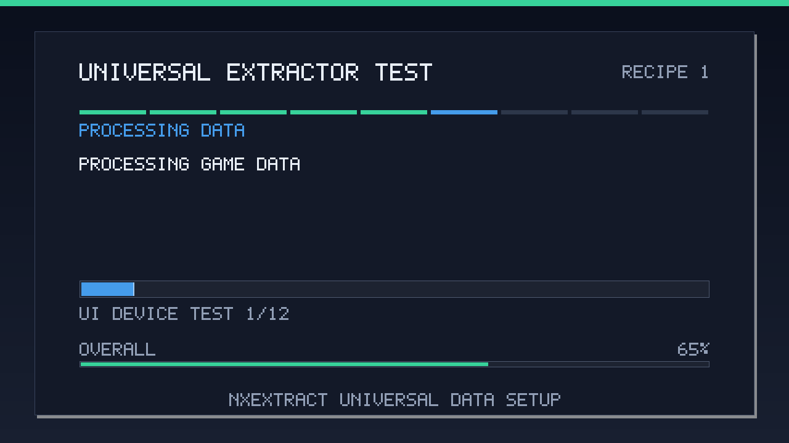
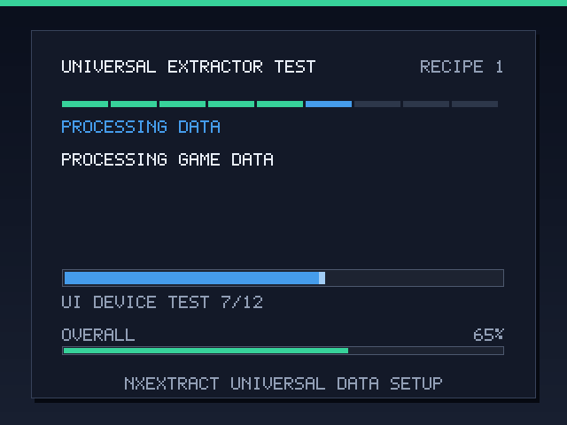

# NXExtract — Extrator/Bake Universal

[](https://github.com/NextOs-Ports/NXExtract/actions/workflows/ci.yml)
[](https://github.com/NextOs-Ports/NXExtract/releases/latest)
[](LICENSE)

NXExtract é um projeto autônomo para preparar dados Android no primeiro boot de
qualquer port Linux. Ele nasceu no NextOS e reúne o fluxo visual aprovado de Bully,
Sonic 4 e Dysmantle com descoberta de pacotes, validação e publicação transacional.

[English](README.en.md) · [Licença MIT](LICENSE) ·
[Arquitetura](docs/ARCHITECTURE.md) ·
[Referência da receita](docs/RECIPE.md) ·
[Matriz de devices](docs/DEVICE-COMPATIBILITY.md)

## Download

Baixe o código na [última versão publicada](https://github.com/NextOs-Ports/NXExtract/releases/latest).
A release também oferece o
[`nxextract-ui-aarch64`](https://github.com/NextOs-Ports/NXExtract/releases/latest/download/nxextract-ui-aarch64)
pré-compilado, exigindo somente GLIBC 2.17. O motor `nxextract.py`, o launcher
genérico e o exemplo de receita ficam no código-fonte da mesma release.

Para desenvolver ou adaptar:

```bash
git clone https://github.com/NextOs-Ports/NXExtract.git
cd NXExtract
./tools/check-release.sh
```

## Interface real nos aparelhos

<p align="center">
  
  
</p>

<p align="center">
  <sub>Capturas reais do mesmo binário: Mali/fbdev 1280×720 e
  KMSDRM 640×480. A carga exibida é 100% sintética.</sub>
</p>

## Apoie e participe

Este projeto é livre sob MIT. Código, testes de novos aparelhos, receitas
sintéticas e documentação são bem-vindos:

- 🐛 **Bugs e propostas**: [GitHub Issues](https://github.com/NextOs-Ports/NXExtract/issues);
- 🔀 **Código**: [Pull Requests](https://github.com/NextOs-Ports/NXExtract/pulls) e
  [guia de contribuição](CONTRIBUTING.md);
- 💬 **Comunidade**: [Discord NextOS](https://discord.gg/DHfY62eDNN);
- 💗 **GitHub Sponsors**: [github.com/sponsors/NextOs-Ports](https://github.com/sponsors/NextOs-Ports);
- ☕ **Ko-fi**: [ko-fi.com/nextos](https://ko-fi.com/nextos);
- 🇧🇷 **PIX**: [livepix.gg/nextos](https://livepix.gg/nextos).

O nome externo do arquivo nunca identifica o jogo. `sonic.apk`, `bully.apkm` ou qualquer
outro nome são apenas nomes: o extrator abre o conteúdo, reconhece a estrutura e só aceita
o conjunto que satisfaz a receita do port.

## O que é universal

- APK único, APKs split soltos, APKM, APKS, XAPK, ZIP/arquivo companheiro, OBB e arquivos
  soltos;
- arquivo externo renomeado, inclusive sem extensão dentro de `gamedata/`;
- seleção automática da ABI conforme o aparelho e a ordem declarada;
- uma única implementação para descoberta, progresso, retomada, validação, rollback e UI;
- bake opcional por hooks sem shell embutido na receita;
- UI adaptativa em SDL2, com texto dinâmico, barras real/geral e estados de sucesso/erro;
- backend visual negociado pela SDL: `mali`/fbdev, KMSDRM, Wayland ou outro backend visível
  anunciado pelo firmware;
- segunda execução rápida pelo marcador validado, sem exigir que o pacote original ainda
  esteja disponível.

“Universal” não significa adivinhar transformações privadas de cada jogo. Cada port
fornece somente um `extractor.json` dizendo quais caminhos internos e hashes são válidos e,
se necessário, um hook próprio para conversão de textura ou outro bake. Ao adicionar um
port novo, não se reescreve mais o extrator.

## Fluxo

```text
pacotes com qualquer nome
        ↓ descoberta pelo conteúdo
APK / splits / APKM / APKS / XAPK / OBB
        ↓ receita + ABI + hashes
plano único e não ambíguo
        ↓ cópia retomável
stage na mesma partição
        ↓ hooks opcionais
validação integral
        ↓ journal + rename + fsync
dados publicados ou rollback automático
```

O pacote legal fornecido pelo usuário nunca é apagado. Dados antigos continuam ativos até
o novo stage passar por todas as validações. Uma queda durante a publicação é resolvida na
execução seguinte: o journal termina uma transação já publicada ou restaura o payload
anterior e preserva o stage para retomada.

## Arquivos

- `nxextract.py`: motor universal, somente Python standard library;
- `nxextract-runtime-env.sh`: limite de processo com bibliotecas do firmware primeiro;
- `run-extractor.sh`: entrada genérica, sem nome de jogo;
- `ui/nxextract_ui.c`: tela de primeiro boot independente do motor;
- `ui/build-ui.sh`: build AArch64 de compatibilidade com gate de glibc;
- `tools/check-glibc.sh`: rejeita ELF acima de GLIBC 2.30;
- `tools/check-release.sh`: testes e gates locais do projeto;
- `examples/recipe-minimal.json`: ponto de partida da receita;
- `tests/`: fixtures sintéticas; não contém dados de jogo.

Em um pacote final, coloque `nxextract.py`, `nxextract-runtime-env.sh`,
`run-extractor.sh`, `nxextract-ui` e `extractor.json` lado a lado no diretório
do port.

## Integração no launcher

O extrator roda em foreground antes do jogo. Não pare o frontend, não use `nohup`,
`setsid` ou processo em background e não fixe `SDL_VIDEODRIVER`.

```bash
GAMEDIR="/storage/roms/ports/meu-port"
cd "$GAMEDIR"

./run-extractor.sh || exit 1
exec ./meu-loader "$GAMEDIR"
```

O wrapper também aceita os overrides genéricos:

```bash
NXEXTRACT_GAME_DIR=/outro/diretorio \
NXEXTRACT_RECIPE=/outro/extractor.json \
./run-extractor.sh
```

Para diagnóstico, um arquivo específico pode ser informado sem depender do nome:

```bash
./run-extractor.sh --input /caminho/arquivo-qualquer
```

Repita `--input` para um conjunto de APKs split soltos.

`run-extractor.sh` abre automaticamente um escopo nativo separado para o
extrator. Nesse filho, diretórios usuais do firmware vêm antes do
`LD_LIBRARY_PATH` herdado e qualquer entrada dentro de `NXEXTRACT_GAME_DIR` é
removida. Assim, SDL2/EGL/DRM da carga privada do jogo não interceptam a UI. O
backend SDL herdado continua intacto; se nenhum backend foi informado, a SDL
continua livre para autodetectar.

Um launcher pode acrescentar somente diretórios conhecidos do firmware ou do
runtime do sistema, sem incluir libs privadas do jogo:

```bash
NXEXTRACT_FIRMWARE_LIBRARY_PATH="/opt/system/Tools/PortMaster/libs" \
  ./run-extractor.sh
```

O helper filtra esse override pela mesma fronteira do diretório do jogo.

O padrão nunca altera os drivers SDL herdados. Somente quando o launcher já
comprovou que esses overrides são inválidos naquele aparelho, ele pode pedir
autodetecção limpa dentro do filho:

```bash
NXEXTRACT_SDL_AUTODETECT=1 ./run-extractor.sh
```

Esse opt-in apenas remove `SDL_VIDEODRIVER`, `SDL_VIDEO_DRIVER` e
`SDL_AUDIODRIVER` do processo do extrator. Ele não escolhe um backend e não
altera o ambiente do jogo.

Para atualizar dados já instalados a partir de uma versão nova, use
`--force-source`. O marcador e a adoção dos dados existentes são ignorados
somente nessa execução; a carga anterior continua ativa até a nova fonte ser
extraída e validada por completo:

```bash
./run-extractor.sh --force-source --input gamedata/arquivo-novo.apk
```

## Criando a receita de um port

Copie `examples/recipe-minimal.json` para `extractor.json` e altere:

1. `id`, `version` e `title`;
2. caminhos internos em `extract[].source.patterns`;
3. destino e raízes de `commit`;
4. validações fortes obtidas da versão legal suportada;
5. hooks apenas se aquele jogo realmente precisa de bake.

O `id` identifica a receita e o `title` aparece na tela. Nenhum deles é o nome esperado do
APK.

### Tipos de fonte

| `kind` | Uso |
|---|---|
| `entry` | exatamente um arquivo dentro de APK/arquivo |
| `entries` | uma árvore de arquivos, com `strip_prefix` ou `flatten` opcional |
| `file` | um arquivo solto |
| `entry_or_file` | aceita a mesma carga dentro do pacote ou solta |

Os padrões aceitam `{abi}` e o destino também aceita `{basename}` para arquivo único.
`scopes` limita a busca a `apk` e/ou `bundle`. O nome externo não participa da seleção;
para arquivo solto, use hash, tamanho e magic para eliminar ambiguidades.

### Validações

Use uma combinação proporcional ao risco:

- `size`, `min_size`, `max_size`;
- `crc32` e `sha256` (um valor ou uma lista de versões aceitas);
- `magic_ascii`, `magic_hex` e `magic_offset`;
- `elf_machine`: `arm64-v8a`, `armeabi-v7a`, `x86_64`, `x86` ou `{abi}` para
  validar automaticamente a ABI que o plano está avaliando;
- árvores: contagem/bytes, `required_paths` e `tree_fingerprint`.

Prefira SHA-256 para biblioteca, OBB e arquivos críticos. Para árvores grandes,
`exact_files`, `exact_bytes` e caminhos sentinela dão uma checagem rápida; use
`tree_fingerprint` quando a receita precisa garantir todo o conjunto.

Antes de testar no aparelho:

```bash
python3 nxextract.py --version
python3 nxextract.py recipe-check --recipe extractor.json
python3 nxextract.py scan --game-dir .
python3 nxextract.py plan \
  --recipe extractor.json \
  --game-dir .
```

Depois da instalação:

```bash
python3 nxextract.py verify \
  --recipe extractor.json \
  --game-dir .
```

## Hooks de bake

Hooks recebem argumentos como lista, nunca uma linha interpretada por shell:

```json
{
  "id": "converter-texturas",
  "argv": [
    "{game_dir}/tools/converter",
    "--input",
    "{stage}/assets",
    "--abi",
    "{abi}"
  ],
  "cwd": "{game_dir}",
  "checkpoint": [
    {
      "path": "assets/.bake-ok",
      "type": "file",
      "sha256": "SHA256_REAL"
    }
  ]
}
```

Templates disponíveis: `{game_dir}`, `{stage}`, `{workspace}`, `{recipe_dir}` e `{abi}`.
O hook deve escrever no `{stage}`, nunca diretamente nos dados vivos. Um checkpoint
validado permite retomar sem repetir um bake caro.

Para atualizar a barra enquanto trabalha, o hook escreve linhas em stdout:

```text
NXEXTRACT_PROGRESS 37 100 CONVERTENDO TEXTURA 37/100
```

Ele também recebe `NXEXTRACT_STAGE`, `NXEXTRACT_WORKSPACE`,
`NXEXTRACT_PROGRESS_FILE`, `NXEXTRACT_GAME_DIR` e `NXEXTRACT_ABI`.

## Build da UI

```bash
./ui/build-ui.sh
```

O build padrão usa o cross-GCC AArch64 do `debian:bullseye` em Docker/Podman e gera
`ui/build/nxextract-ui`. Todo ELF distribuído com o extrator precisa exigir
**GLIBC 2.30 ou anterior**:

```bash
./tools/check-glibc.sh ./ui/build/nxextract-ui
```

A UI atual exige somente GLIBC 2.17. Ela carrega SDL2 em runtime; por isso o executável
não fica preso à SDL de um único firmware. Se nenhum renderer visível abrir, a extração
continua headless e mantém todas as garantias transacionais.

O motor requer Python 3.7 ou mais novo e usa apenas a biblioteca padrão. Hooks AArch64
compilados também fazem parte do kit e devem passar pelo mesmo gate GLIBC.

Para rodar testes, validação da receita, sintaxe C/shell e o gate:

```bash
./tools/check-release.sh
```

## Garantias e limites

- paths absolutos, `..`, ZIP traversal, symlinks, entradas criptografadas, duplicadas e
  colisões por maiúsculas/minúsculas são rejeitados;
- APKs split só são agrupados quando o package do `AndroidManifest.xml` coincide;
- dois payloads diferentes que atendem à mesma receita geram erro de ambiguidade;
- um caminho interno presente que falha tamanho, hash, CRC ou arquitetura ELF
  é relatado como candidato rejeitado, com um exemplo para distinguir uma
  versão diferente do jogo de um arquivo realmente ausente;
- expansão de bundles e payload têm limites e preflight de espaço;
- cópias usam arquivo parcial, CRC, `fsync` e retomada;
- lock impede duas instalações simultâneas;
- troca final usa journal, backup e rollback;
- o marcador inclui digest da receita; mudar a receita/versionamento invalida o fast path.

## Projeto público e licença

NXExtract usa a [Licença MIT](LICENSE). Qualquer pessoa pode usar, adaptar, criar fork,
publicar e redistribuir o código mantendo o aviso da licença. APKs, OBBs e dados dos jogos
não fazem parte do projeto.

Como contribuir, documentar um device novo e registrar uma validação sem vazar IP,
credencial ou dado de jogo:

- [guia de contribuição](CONTRIBUTING.md);
- [matriz e protocolo de validação](docs/DEVICE-COMPATIBILITY.md);
- [política de segurança](SECURITY.md);
- [histórico de versões](CHANGELOG.md).
